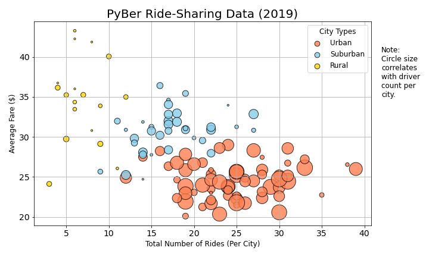
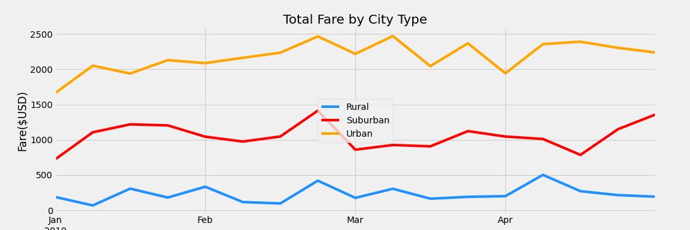

# PyBer Ride-share Analysis

## Overview
The scope of this analysis is to assist PyBer executives in understanding their ride share activity in rural, urban, and suburban communities. This analysis will deconstruct the total number of rides, drivers, and the total fare for these neighborhoods based on data from January 1, 2019 to April 30, 2019.

Finally, we will wrap up with recommendations on improving PyBer’s service in underserved communities and addressing overserved areas. 

## Results
PyBer offers ride-sharing services in three major city types: urban, suburban, and rural. Between January 1, 2019 and April 30, 2019, 2973 drivers provided 2375 rides to ride-share customers totaling $63538.64 in fares.

### Urban
For this period, urban cities accounted for 1625 total rides provided by 2495 drivers. Total fares came out to $39,854.38 with an average fare of $24.53 and an average Drivers $16.57 per driver.

### Suburban
For the same period, urban cities saw 625 total rides provided by 490 drivers. Total fares came out to $19,356.33 with an average fare of $30.97 and an average Drivers $39.50 per driver.

### Rural
Finally, rural cities saw 125 total rides provided by 78 drivers. Total fares came out to $4,327.93 with an average fare of $34.62and an average Drivers $55.49 per driver.

## Summary

Immediately, we can see that rural areas are underserved compared to urban and suburban cities, with only 2.6% of PyBer’s driver population. As expected, urban markets are saturated with 80.9% of drivers but only 68.4% of the total rides. Suburban areas are just moderately underserved with 625 total rides provided by 490 drivers.

Our primary recommendation is to increase the number of drivers available to ride-share customers in rural areas. Similarly, the number of drivers could be increased slightly in suburban cities. An effective means of accomplishing both of these proposals would be to offer incentives to drivers in urban neighborhoods to offer their services in more rural areas. 

PyBer may also consider surveying customers in suburban areas to understand if they *feel* underserved. The numbers in this category suggest the market is underserved, but competitive. Customer feedback would be key here to understand the need for more drivers.
